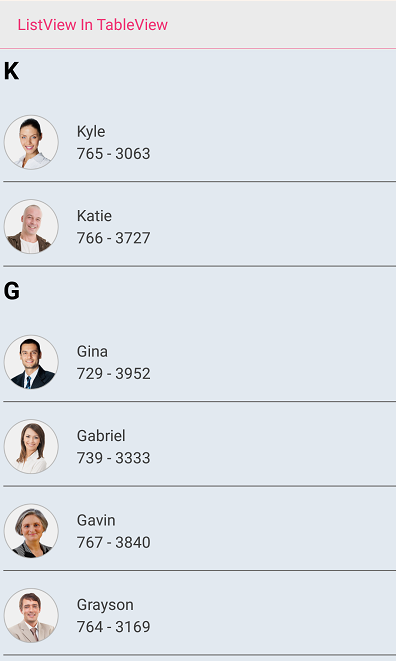

# How to load a listview in Xamarin.Forms TableView?

This example demonstrates how to load a listview in Xamarin.Forms TableView.

## Sample

```xaml
<TableView Intent="Data" HasUnevenRows="True" VerticalOptions="FillAndExpand">
    <TableView.Root>
        <TableSection Title="ListView In TableView" >
            <ViewCell>
                <ViewCell.View>
                    <syncfusion:SfListView x:Name="listView" BackgroundColor="AliceBlue" AllowGroupExpandCollapse="True" 
                            ItemSpacing="3" ItemSize="70" ItemsSource="{Binding contactsinfo}">
                        <syncfusion:SfListView.ItemTemplate>
                            <DataTemplate>
                                <ViewCell>
                                    <ViewCell.View>
                                        <code>
                                        . . .
                                        . . .
                                        <code>
                                    </ViewCell.View>
                                </ViewCell>
                            </DataTemplate>
                        </syncfusion:SfListView.ItemTemplate>
                    </syncfusion:SfListView>
                </ViewCell.View>
            </ViewCell>
        </TableSection>
    </TableView.Root>
</TableView>
```

See [How to load a listview in Xamarin.Forms TableView](https://www.syncfusion.com/kb/10010/how-to-load-a-listview-in-xamarin-forms-tableview) for more details.



## Requirements to run the demo

* [Visual Studio 2017](https://visualstudio.microsoft.com/downloads/) or [Visual Studio for Mac](https://visualstudio.microsoft.com/vs/mac/)
* Xamarin add-ons for Visual Studio (available via the Visual Studio installer).

## Troubleshooting

### Path too long exception

If you are facing path too long exception when building this example project, close Visual Studio and rename the repository to short and build the project.
